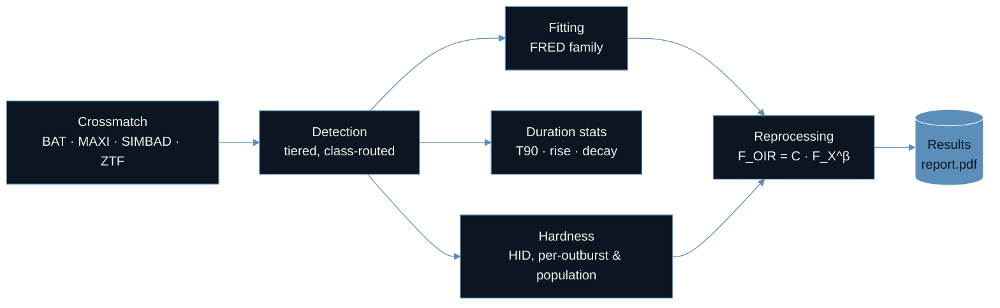

<p align="center">
  
</p>
<div align="center">

<!--
  Hero banner goes here. Suggested dimensions: 1200x400px (3:1), dark-navy
  background (#0B1622) to match the palette below. Drop the file at
  docs/assets/banner.png and uncomment the line below.
-->
<!--  -->

# Multiwavelength Analysis of X-ray Binary Outbursts

**MAXI + ZTF pipeline for detecting, fitting, and modelling X-ray binary outbursts as optical–X-ray reprocessing**

[](LICENSE)
[](pyproject.toml)
[](notebooks/)

**[Overview](#overview) · [Methods](#methods) · [Results](#results) · [Pipeline](#pipeline)**

</div>

---

## Overview

Pipeline for identifying, fitting, and characterising X-ray binary (XRB)
outbursts using MAXI (X-ray) and ZTF (optical) light curves, and
modelling the optical emission as X-ray reprocessing. Built for KSP-07
(Summer 2026); see [`docs/report.pdf`](docs/report.pdf) for the full
write-up and physical background, and [`docs/algorithms.md`](docs/algorithms.md)
for a code-facing explanation of how each stage works.

**What it does:**

1. **Cross-match** Swift/BAT, MAXI, SIMBAD and ZTF to build a sample of
   confirmed XRBs with optical counterparts, and classify a broader
   MAXI-wide sample as BH/NS and persistent/transient using BlackCAT
   and the Liu et al. catalogs.
2. **Detect outbursts** in MAXI light curves via a class-routed,
   sigma-thresholded peak finder (separate tuning for BH LXBs, NS LXBs,
   and HXBs, with an optional hardness-ratio veto).
3. **Fit** each outburst with a Fast-Rise-Exponential-Decay (FRED)
   profile — plain, with a flat-top plateau, or an asymmetric
   variant — and compute duration statistics (T90, rise/decay times).
4. **Track spectral state** via Hardness-Intensity Diagrams in both
   X-ray (MAXI sub-bands) and optical (ZTF color).
5. **Model the optical outburst** as X-ray reprocessing,
   `F_OIR = C_source · F_X^β`, calibrated per outburst against fixed
   literature betas and, separately, with β left free.

---

## Methods

Full derivations live in [`docs/algorithms.md`](docs/algorithms.md) (code-facing) and
[`docs/report.pdf`](docs/report.pdf) (physics). Summary, stage by stage:

| Stage | Method |
|---|---|
| **Cross-matching** | Sequential otype/position/name matching: MAXI ↔ SIMBAD (2′), BAT ↔ MAXI ↔ SIMBAD ↔ ZTF (5″), then BlackCAT + Liu et al. LMXB/HMXB catalogs for BH/NS + persistent/transient classification |
| **Detection** | Iterative sigma-clipped baseline (unbiased against long/frequent outbursts) → `find_peaks` with a prominence + minimum-separation constraint → gap-tolerant boundary walk. Class-routed thresholds for BH LXB / NS LXB / unknown LXB / HXB; NS LXBs get a hardness-ratio softening veto |
| **Fitting** | Fast-Rise-Exponential-Decay (FRED) family: plain, flat-top plateau, and independent-amplitude asymmetric variants, all via `scipy.optimize.curve_fit`. `chi2_red` reported but never used to auto-reject a fit |
| **Duration statistics** | T90 via cumulative net fluence (same formalism as GRB T90); split at the flux peak for T_rise/T_decay |
| **Hardness tracking** | HR = flux(4–10 keV)/flux(2–4 keV); optical analogue is a ZTF band-difference "color". Both per-outburst and whole-catalogue population views |
| **Reprocessing** | `F_OIR = C_source · F_X^β`, calibrated on **hard-state epochs only** (soft-state excluded — the disc emission mechanism changes) against two literature β anchors, then re-fit with β free via weighted least squares |

---

## Results

Headline numbers from the KSP-07 report (full detail and figures in
[`docs/report.pdf`](docs/report.pdf)):

- **Cross-matching**: 932 Swift/BAT sources → 270 with a MAXI light curve → 266 SIMBAD-resolved → 86 with a ZTF counterpart → **20 confirmed XRBs** with simultaneous multi-band coverage (the "Gold" sample).
- **Classification**: a broader MAXI-wide sample of 186 transients classified as **30 black holes, 29 neutron stars** (127 unclassified), 37 persistent / 44 transient.
- **Duration statistics**: BH outbursts are systematically longer than NS outbursts — median decay time ≈ 64 d (BH) vs ≈ 28 d (NS); median rise ≈ 18 d (BH) vs ≈ 10 d (NS) — consistent with larger accretion discs taking longer to both ignite and drain.
- **Reprocessing**: free-fit β slopes cluster near 0.5–0.6 across sources, consistent with X-ray disc reprocessing as the dominant hard-state optical emission mechanism, with per-source scatter suggesting secondary jet contributions in several BH LMXBs.

<!--
  Result figures go here once exported, e.g.:
  <p align="center">
    
    
  </p>
  Generate them with notebooks/04_duration_histograms.ipynb and
  notebooks/05_hardness_hid.ipynb — call xrb_pipeline.utils.plot_style.apply()
  first to match this README's palette.
-->

---

## Pipeline



### Repository layout

```
src/xrb_pipeline/     Importable pipeline modules (see below)
notebooks/            One notebook per pipeline stage, for interactive use
scripts/              Standalone CLI scripts for common one-off tasks
docs/                 Report PDF, algorithm notes, JSON schema, phase-0 guide
data/                 Empty -- see "Data" below
```

`src/xrb_pipeline/` is organised by pipeline stage, matching the report
chapters:

| Module | Report section | What's in it |
|---|---|---|
| `crossmatch/` | 3.1, 3.2 | MAXI-SIMBAD prefilter (true step 1); BAT-MAXI-SIMBAD-ZTF matching; BH/NS + persistent/transient classification |
| `detection/` | 4.1, 4.2 | Simple threshold detector; class-routed tiered detector |
| `fitting/` | 5.1, 5.2 | Pure FRED, FRED+tophat, asymmetric burst profile, multi-FRED (bonus) |
| `duration_stats/` | 6 | T90, T_rise, T_decay |
| `hardness/` | 7 | Per-outburst X-ray+optical HID; whole-catalogue population HID |
| `reprocessing/` | 8 | Manual inspector (FRED fit + hard-state calibration), optical simulation, free-beta fitting |
| `utils/` | -- | Shared MAXI/ZTF fetch, outburst-profile models, JSON database helpers, optional plotting style |

### Installation

```bash
git clone https://github.com/samiul-bashir/xrb-outburst-analysis.git
cd xrb-outburst-analysis
pip install -r requirements.txt
pip install -e .   # optional, if you want `import xrb_pipeline` from anywhere
```

Or without an editable install, just add `src/` to your path:

```bash
export PYTHONPATH=src
```

### Usage

Each pipeline stage can be run as a script or imported as a library.

```bash
# 1. Cross-match and classify
python -m xrb_pipeline.crossmatch.maxi_simbad_prefilter --output step1_maxi_xrb_sources.csv
python -m xrb_pipeline.crossmatch.classify_compact_objects --input step1_maxi_xrb_sources.csv
python -m xrb_pipeline.crossmatch.bat_maxi_simbad_ztf --bat-fits BAT_catalog.fits --outdir data/crossmatch

# 2. Detect outbursts
python -m xrb_pipeline.detection.tiered_detector --input step1b_maxi_xrb_classified.csv

# 3. Duration statistics
python -m xrb_pipeline.duration_stats.duration_metrics --outbursts step2_outbursts.csv --classified step1b_maxi_xrb_classified.csv

# 4. Population-level hardness (needs step4_master_catalogue.csv -- duration stats output
#    merged with detection's compact_object/source_type columns)
python -m xrb_pipeline.hardness.population_hid --master step4_master_catalogue.csv
```

For interactive, per-source work (manual outburst inspection, FRED
fitting, HID plots), use the notebooks in `notebooks/` — these follow
the session workflow described in
[`docs/xrb_outburst_inspector_guide_phase0.md`](docs/xrb_outburst_inspector_guide_phase0.md).

To match this README's visual palette in your own exported figures:

```python
from xrb_pipeline.utils.plot_style import apply
apply()   # dark navy / off-white / muted blue, applied to matplotlib rcParams
```

#### Scripts

`scripts/` has small standalone tools that don't need the full
pipeline context — useful starting points to modify for a one-off
task:

- `scripts/fetch_lightcurve.py` — fetch and plot a single MAXI light
  curve by source ID.
- `scripts/quick_outburst_scan.py` — run the simple detector on one
  source and print/plot what it finds, without touching the JSON
  database or the classified catalogue.

### Data

This repo ships no data. You'll need:

- A Swift/BAT catalog FITS file (for cross-matching) — e.g. the
  Swift/BAT 157-month hard X-ray catalog.
- MAXI, SIMBAD, ZTF/ALeRCE, VizieR (Liu et al. LMXB/HMXB) and BlackCAT
  are all queried live over HTTP; no local copies needed beyond the
  BAT FITS file. Be considerate of the MAXI server (the crossmatch
  script already rate-limits itself).

The persistent per-outburst database (`xrb_outbursts.json`) is built
and grown by the notebooks in `notebooks/` as you inspect and fit
sources; see [`docs/json_db_schema.md`](docs/json_db_schema.md).

---

## Citing / license

MIT licensed — see [`LICENSE`](LICENSE). Citation metadata (for the
"Cite this repository" button on GitHub) is in
[`CITATION.cff`](CITATION.cff). If you use this code, please cite the
accompanying report: Samiu Bashir, *"Multiwavelength Analysis of X-ray
Binary Outbursts"*, KSP-07, Summer 2026, mentored by Anirudh Salgundi
(University of North Carolina at Chapel Hill).
